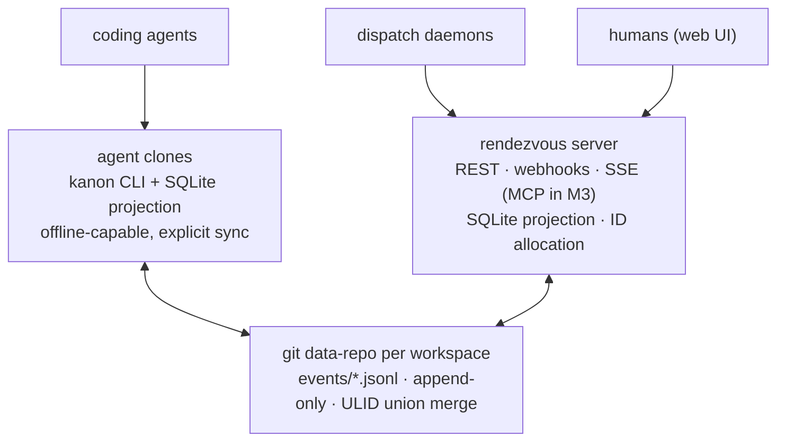

# Kanon

**An agent-native work tracker.** Kanon (Greek: κανών, *rule / measure*) is a Linear-class
system of record built for a world where the primary writers are AI agents and the humans
orchestrate — not the other way around.

## The architecture in one paragraph

The canonical store is an **attributed append-only event log**, carried as JSONL segments in
one **git data-repo per workspace**. Every store that answers queries — the SQLite cache a
CLI reads, the rendezvous server's projection, the web UI — is a **rebuildable projection**
of that log. Merge is ULID-ordered union with per-field last-write-wins and OR-Set relations:
concurrent agents can't lose writes, offline clones converge deterministically, and every
mutation permanently records *who* (human, agent, session) did *what*, on *which surface*.



Why this shape: SQL-vs-filesystem is a false binary. Linear's own sync engine is a
per-workspace action log with everything else as projections; git-backed agent trackers
(beads) proved the ergonomics. Kanon takes the log as the first-class citizen and designs
out the operational failure modes: **no hidden sync daemon** (explicit `kanon sync`),
segments + snapshots from day one, disposable caches, and a first-class rendezvous server.

## Design commitments

- **Agents first.** `--json` everywhere, ready-work queries, grep-able state, worktree-native.
- **Attribution is structural.** Every event carries `{actorType, actorId, sessionId, surface}`.
- **Hard tenant isolation.** One workspace = one data repo. Different orgs never share a log.
- **ULIDs are keys; `TEAM-123` identifiers are display aliases** allocated at the rendezvous.
- **Convergence is tested, not assumed.** Property tests gate the merge: N clones, random
  concurrent event sets, identical projections.
- **Linear-compatible agent contract.** The MCP surface (M3) mirrors the `linear-server`
  tool names and arg shapes, so agent fleets migrate with a config swap. Issues carry both
  `assignee` (accountable human) and `delegate` (agent); agent sessions follow the
  thought / elicitation / action / response / error activity model.

## Status: M2

| Milestone | Scope | Status |
|---|---|---|
| M0 | Scaffold, event schema v1, `kanon init` / `kanon validate` | done |
| M1 | Core merge/replay + SQLite projection + CLI lifecycle + Linear import | done |
| M2 | Rendezvous server: REST v1, ID allocation, webhooks, event feed | done |
| M3 | MCP parity (`linear-server` drop-in) + agent sessions/delegation | **here** (Phase 1: tool parity over stdio; Phase 2: agent sessions) |
| M4 | Web UI (list/board/detail/cmd-K, SSE) | planned |
| M5 | Initiatives/status updates/documents + migration tooling | planned |

## Quick start

```sh
bun install
bun run ci          # lint + typecheck + tests + build

# create a workspace data repo
bun packages/cli/src/index.ts init ~/kanon-data-myteam --workspace myteam
bun packages/cli/src/index.ts validate ~/kanon-data-myteam

# work
alias kanon="bun $PWD/packages/cli/src/index.ts"   # or build the binary: bun run --cwd packages/cli build
export KANON_REPO=~/kanon-data-myteam
kanon team create --key BRO --name Broomva
kanon issue create --team BRO --title "Ship M1" --priority 2 --label infra
kanon issue ready --team BRO
kanon issue claim BRO-1
kanon sync
```

## CLI commands

Lifecycle commands take `--repo <dir>` (default `$KANON_REPO`, then cwd) and `--json`
(machine-readable output on every read command). `<ref>` is a ULID or a display
identifier like `BRO-123` (case-insensitive). Actor identity comes from
`KANON_ACTOR` / `KANON_ACTOR_TYPE` (`agent` for agents) / `KANON_SESSION`, falling
back to `git config user.email`, then `user@host`.

| Command | What it does |
|---|---|
| `kanon init <dir> --workspace <slug> [--no-git]` | create a data repo (log + meta + `.gitattributes` with `events/*.jsonl merge=union`) |
| `kanon validate <dir>` | schema-check every event, flag duplicates/corruption |
| `kanon team create --key BRO --name Broomva` | create a team + the 7 default workflow states (Triage/Backlog/Todo/In Progress/Done/Canceled/Duplicate) |
| `kanon team list` | list teams |
| `kanon issue create --team BRO --title ... [--description --priority 0-4 --estimate --assignee --delegate --project --milestone --parent --label a --label b]` | create an issue; allocates the next display number and prints `BRO-1652` |
| `kanon issue show <ref>` | issue + comments + relations |
| `kanon issue list [--team --state --assignee --delegate --project --label --priority --parent --updated-after --updated-before --query --no-archived --order-by --order-dir --limit --offset]` | filtered listing |
| `kanon issue ready [--team]` | unblocked backlog/unstarted work — the agent queue. Blocked = a `blocks` relation points at the issue from a blocker that is not completed/canceled. Deliberate: an **archived-but-open blocker still blocks** (archiving hides an issue, it does not complete it) — complete/cancel the blocker or `unrelate` to unblock dependents |
| `kanon issue update <ref> [--state <type\|name\|id> --title --description --priority --estimate --assignee --delegate --add-label --remove-label]` | field updates (per-field LWW) |
| `kanon issue claim <ref>` | agents take the delegate seat, humans take assignee; moves to a started state |
| `kanon issue archive <ref>` | archive |
| `kanon issue comment <ref> --body ...` | comment (actor entity minted on first use) |
| `kanon issue relate <ref> --blocks\|--blocked-by\|--related-to <ref2>` | relations; `blocks` direction: `issue_id` blocks `related_issue_id` |
| `kanon issue unrelate <ref> --blocks\|--blocked-by\|--related-to <ref2>` | remove a relation |
| `kanon project create/list`, `kanon milestone create/list` | projects + milestones |
| `kanon sync` | `git add` log paths → commit → `pull --rebase` (segments union-merge) → push; each step surfaced |
| `kanon doctor` | repair post-merge duplicate identifiers (later-ULID issue gets the next free number) + stale meta.json watermarks |
| `kanon log [--limit N]` | last N events of the canonical stream |

The event contract is language-neutral: [`packages/core/schema/event.schema.json`](packages/core/schema/event.schema.json).
Rust, Python, or anything else can read and write the log directly.

## Rendezvous server

One server per workspace data repo — REST v1, durable event feed
(`/v1/sync/events`), SSE, signed webhooks, and display-ID allocation, with the
same SQLite projection the CLI uses (rebuildability is the gate; the substrate
is disposable by contract). Auth v1 is env bearer keys. Kanon is standalone:
no orchestrator-specific adapters — the feed + webhooks ARE the contract, and
[`examples/runner/`](examples/runner/) is an ~80-line reference dispatcher any
daemon/CI/cron can reimplement.

```sh
KANON_DATA_DIR=~/kanon-data-myteam \
KANON_API_KEYS="s3cret-token:carlos@example.com:human" \
bun apps/server/src/index.ts
```

Full API table, tenancy/auth model, webhook signature verification, and
Railway deploy notes: [`apps/server/README.md`](apps/server/README.md).

## License

[MIT](LICENSE)
